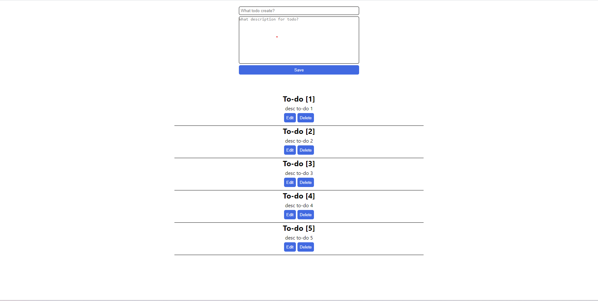

<h1 align="center">📗 Sobre o projeto</h1>

---

<h2 align="center">🔨 Ferramentas</h2>

As seguintes ferramentas foram usadas na construção do projeto:

- [REACT](https://react.dev/learn/react-developer-tools)
- [SASS](https://sass-lang.com/)

---

<h2 align="center">👨‍🎓 Autor</h2>

<h3 align="center">
<a href="https://igorlimasandes.netlify.app">

 
Igor Sandes
</a>

 
 

 

</h3>
